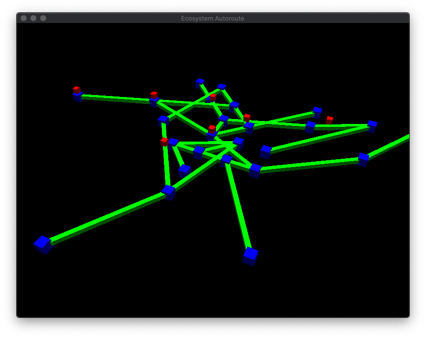
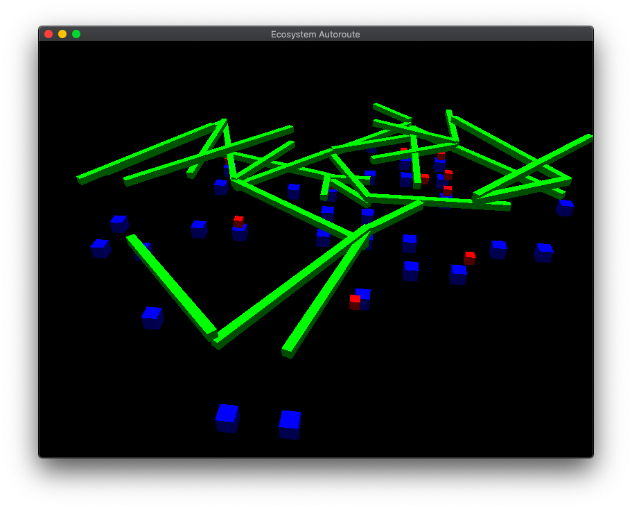
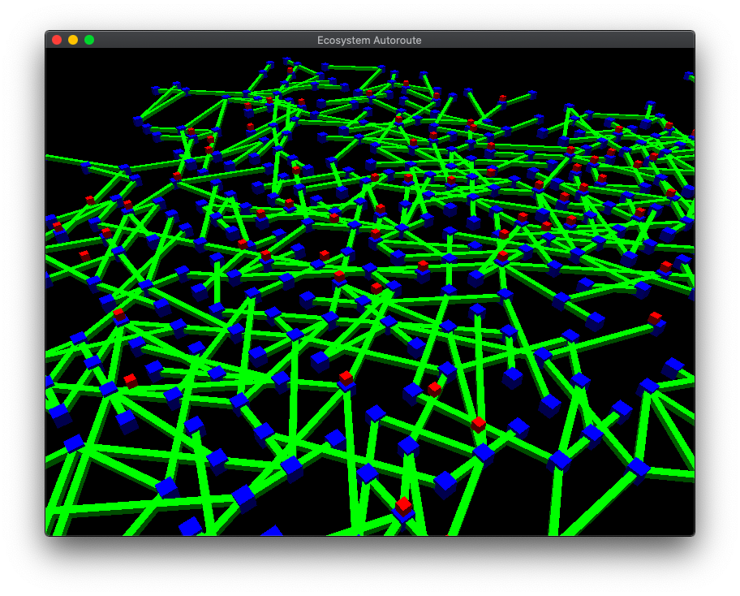
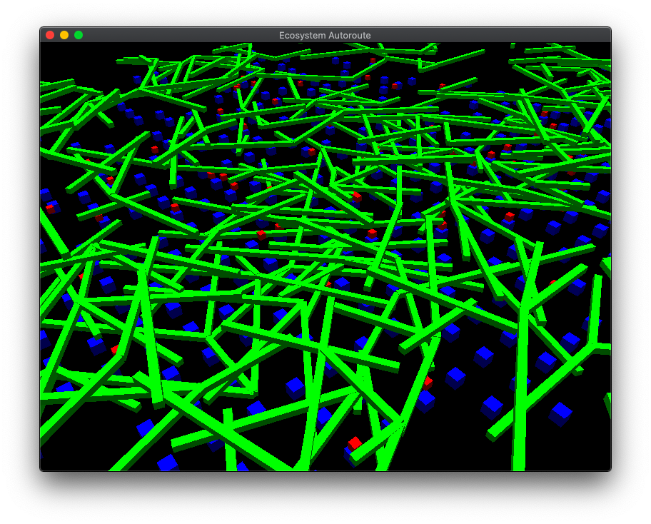

# 3D-Highway-Graph
> 3D Representation of graph with cars on it.


This is a work for one of my college course, we had to implement an ecosystem of roads and cars.

Since it's a French course, all the comment will be in french.


<!-- GETTING STARTED -->
## Getting Started

### Prerequisites

To compile this project, you need to install

- [GLFW](https://www.glfw.org)
- [Glad](https://glad.dav1d.de)

### Installation

#### Linux and MacOS

1. Simply type make in your terminal

```sh
make
```
(note : If you're on linux, change the -framework openGL line in the makefile with your path to the openGL library)


## Usage example

Simply execute a.out and watch the result

```sh
./a.out
```

## Exemple









## Meta

Magniadas Guillaume – [@YourTwitter](https://twitter.com/dbader_org) – YourEmail@example.com

[https://github.com/TheMagnat/github-link](https://github.com/TheMagnat/)


